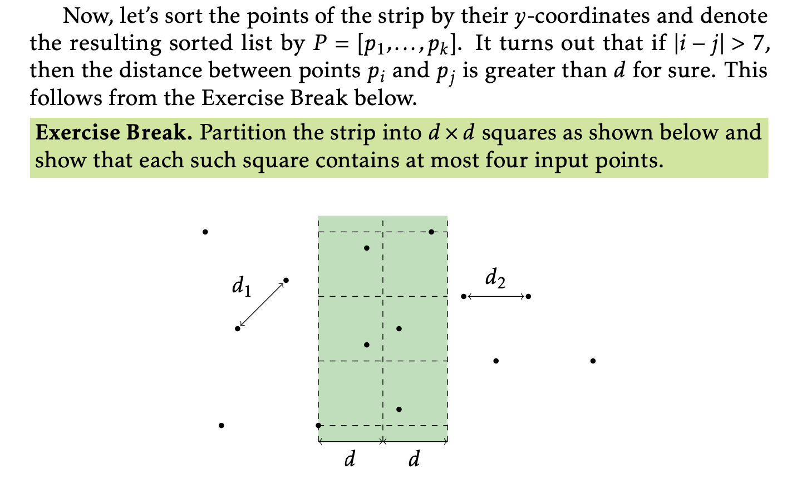

# The Problem:
Closest Points Problem  
Find the closest pair of points in a set of points on a plane.  
* Input: A list of n points on a plane.  
* Output: The minimum distance between a pair of these points.  

# First attempt $(N\log(N)^2)$ Solution
Good student follow the book.
## Algorithm process:
The course's "toolbox_statement" tells very clear about the algorithm:
1. Preprocessor procedure: sort the points array by x-coordinate.
2. Recursive procedure: try_minimal_distance(points)
    1. using the middle point as pivot to split the input points to left and right part.recursively call try_minimal_distance minimal_distance of left part and right
    part.
    2. min_distance = min(left_part_minimal_distance, right_part_minimal_distance)
    3. consider the points in the strip (pivot - min_distance, pivot + min_distance).
    the minimal_distance of input point is min(min_distance, point's minimal_distance in the strip).
    4. finding the minimal_distance in the strip seems like an $O(N^2)$ work, but when your reorder the points in the strip by y-coordinate, and you can prove that you  only need pair(i, j) which i<j<=i+7. more detail seem the picture from the "toolbox_statement":
    >  
    which make the runtime to $O(N\log{N})$ (reordering).
##  Interesting points and Summaries:
I implement my finding minmal distance in the following:
```C++
for (int i = 0; i < strips.size() - 1; i++) {
    for (int j = i + 1; j < strip.size() && j < i + 7; j++) {
        min_distance = min(strip[j].distance_to(strip[i]), min_distance);
    }
}
```
1. This code has a Bug. if strips.size() return unsigned int, size - 1 will be the largest unsigned int. the Solution is modify it to `i < strip.size()`;
2. the code is good, but I realize that if `strip[j].y - strip[i].y < min_distance` =>
`j <= i + 7` and the opposite(`j <= i + 7` => `strip[j].y - strip[i].y < min_distance`) is not true in most case. So change it to `j < strip.size() && strip[j] - strip[i] < min_distance` will be more effective. But there is trap in this code. it will still check j from `i + 1` to `size -1`, that make the runtime degenerate to $O(N^2)$. So the right way should be 
```C++
for (int i = 0; i < strips.size() - 1; i++) {
    for (int j = i + 1; j < strip.size(); j++) {
        if (strip[j].y - strip[i].y > min_distance) break;
        min_distance = min(strip[j].distance_to(strip[i]), min_distance);
    }
}    
```

# Precision issues
Case #23/23 encountered a failure due to precision problems, as highlighted by Xavier Corbella Coll and Pawan Nirpal who from the coursera discussion forum. After multiple attempts in their inspiration, I have formulated a hypothesis and a solution:

I speculate that in C++, the grader receives a result string from our program, converts it to a double value, and checks if the absolute difference between our double result and the expected value is less than a threshold (e = 1e-8, perhaps). The issue arises from the grader's choice of a not sufficiently large enough 'e.'

Suppose the grader possesses a more precise value (without which our efforts would be futile); in that case, we should aim to reduce the inaccuracy in our results. The inaccuracy stems from two sources:

1. The calculation of distance using `sqrt((x - o.x) * (x - o.x) + (y - o.y) * (y - o.y))`
2. Rounding the result using `std::cout << std::setprecision(9) << minimal_distance(x, y)`
Mitigating inaccuracy from both sources is crucial to solving the problem.

Here is my proposed solution:

1. Modify the distance calculation to `sqrt((long double)(x - o.x) * (x - o.x) + (long double)(y - o.y) * (y - o.y))` and change all relevant variables and return types from double to long double. Note the use of typecasting in sqrt() to ensure it overloads the long double version of sqrt and avoids integer overflow issues.
2. Adjust the rounding to `std::cout << std::setprecision(14) << minimal_distance(x, y)`.

Pawan Nirpal suggested that changing `std::setprecision(9)` to `std::setprecision(8)` will also resolve the issue. My hypothesis is that in Case #23, the inaccuracy from type 1 is positive/negative, while type 2 is negative/positive. Increasing the inaccuracy of type 2 surprisingly decreases the total inaccuracy.

# Second attempt $(N\log(N))$ Solution
Don't be a greedy kid.  
In preprocessor procedure of the first solution, I try to sort the points array by x-coordinate. This makes the split point array operation $O(1)$, and the find point in strip more effective by using binary search. I am too greedy to give up this improvement. so I was stuck for this question "How to use the x-coordinate sorted array to generate y-coordinate sorted array in $O(N)$?" 1 or 2 days. Then I suddenly realize that, if I give up the x-coordinate sorted benefit then I can easily generate y-coordinate sorted array in $O(N)$ in each recursive process.
## algorithm process:
1. In preprocessor procedure: sort the points by y-coordinate.
2. in each recursive process. split the y-coordinate sorted array using a random pivot.
3. find the points which in strip by scanning all left or right the array. your get the left_points_in_strip and right_points_in_strip are still y-coordinate sorted.
4. using merge algorithm the merge the 2 part together to get y-coordinate sorted total strip, just taking $O(N)$.
## interesting points and summaries:
1. There is a pitfall, when all points' x-coordinate are the same, what will happen you choose a random point's x-coordinate as pivot? It will cause the problem size do not decrease. The solution is random make the points to left or right when their x-coordinate is equal to the pivot.
2. give up the x-coordinate sorted feature will cause some ineffective, but it won't increase any asymptotic time complexity. When design an algorithm, first we should pursue the best asymptotic time complexity then the engineering optimization. "retreat in order to advance", and "Don't be a greedy kid"

# Third attempt $(N\log(N))$ Solve  "How to use the x-coordinate sorted array to generate y-coordinate sorted array in $O(N)$?"
Sometimes greedy kid get luck.  
I take one more day to get the problem's solution.
I need a points_x_order to efficiently split 2 parts and find strip points and I also need the strip points is y-coordinate sorted. I can processes 2 array x_ordered and y_ordered in preprocessor. The key is I need another array which can map index of x_ordered to index of y_ordered.
```
struct WholeOrderVector {
  vector<T> objects_0_order;
  vector<T> objects_1_order;
  vector<int> index_0_to_1;
};
```
And I need a function which can do its job in $O(N)$
```
void sub_range_by_position(WholeOrderVector<T>&wo_objects, int left_0_pos, int right_0_pos, WholeOrderVector<T>& result)
```
The key implement of the function is follow.
```
vector<int> index_1_to_0(wo_objects_size, -1);

for (int i = left_0_pos; i <= right_0_pos; i++) {
    index_1_to_0[wo_objects.index_0_to_1[i]] = i;
    result.objects_0_order.push_back(wo_objects.objects_0_order[i]);
}

for (int j = 0; j < wo_objects.objects_1_order.size(); j++) {
    if (index_1_to_0[j] > -1) {
        result.objects_1_order.
          push_back(wo_objects.objects_1_order[j]);
        int new_1_index = result.objects_1_order.size() - 1;
        int new_0_index = index_1_to_0[j] - left_0_pos;
        result.index_0_to_1[new_0_index] = new_1_index;
    }
}

```

# Extra Information: using KD-tree can also solving this problem in $O(N\log{N})$

All detail code you can find in my github [https://github.com/ale-z/UCSD-Algorithms]https://github.com/ale-z/UCSD-Algorithms


